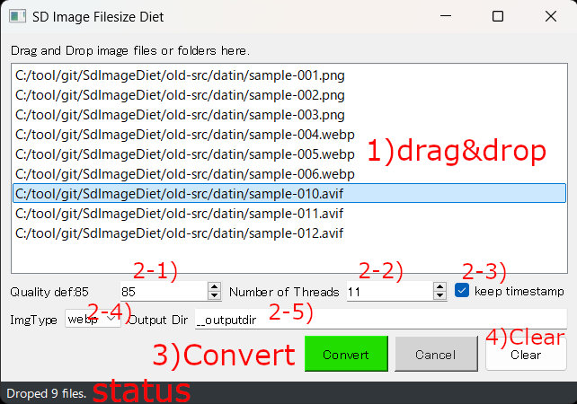

## SdImageDietについて 0.1.9
StableDiffusionで作成したPNG,JPG,WEBP,AVIF画像のプロンプト情報を保持したまま【**マルチスレッド**】で高速にJPG,WEBP画像に変換します  
主にPrompt情報は後で参考にしたいが、画像品質を犠牲にしてファイルサイズを小さくしたい利用シーンを想定しています  
また、比較的どうでも良い画像ファイルの容量削減なんかにも便利です  

## 特徴
- 変換後のファイルでもPNG Infoタブで読み込んでtxt2txtなどに送る事が可能  
- **マルチスレッド**で高速に動作 ※1  
- 複数ファイルか単一フォルダのドラッグ＆ドロップに対応 ※2  
- 変換したファイルのタイムスタンプを元の画像ファイルに合わせる事も可能  
- Quality指定により画像品質を犠牲にすればファイルサイズを10分の1から50分の1に縮小可能  
- お好みでGUIでもCUIでも利用可能  

※1:Ryzen5 5600で1024x1344dotの<ins>**PNG1000枚**</ins>をJPGに変換するのに<ins>**7秒程度**</ins>、WEBPであれば1分強  
※2:GUI版のみ  

## インストール方法（簡易）
[簡易インストール版zipのダウンロード]  
    https://github.com/nekotodance/SdImageDiet/releases/download/latest/SdImageDietGUI.zip

- Pythonのインストール（SD標準の3.10.6推奨）  
- zipファイルを解凍  
- 解凍したフォルダ内の「SdImageDietGUI-install.ps1」を右クリックして「PowerShellで実行」を選択  
> [!WARNING]
> シェルスクリプトはデフォルトでは動作しない設定となっています  
> その場合はターミナルを管理者として実行し、以下のコマンドを実行してください（比較的安全な方式）  
> Set-ExecutionPolicy Unrestricted -Scope CurrentUser -Force

- イントールの最後にデスクトップにリンクをコピーするかどうかを聞いてきます  
「"Do you want to copy the shortcut to your desktop? (y or enter/n)」  
必要があれば「y」入力後、もしくはそのまま「enter」キー  
必要なければ「n」入力後「enter」キー  
- SdImageDietGUIリンクが作成されます  

リンクファイルをダブルクリックして起動できます

## インストール方法（手動）
- gitでリポジトリを取得  
  `git clone https://github.com/nekotodance/SdImageDiet`
- 必要なライブラリ  
  `pip install -r requirements.txt`
- 実行方法  
  `Python SdImageDietGUI.py`

## 利用方法（GUI版）

#### 1) アプリ上に複数の画像ファイルか単一フォルダをドラッグ＆ドロップしてください  
PNG、JPG、WEBP、AVIFの画像ファイルの入力に対応しています  
> [!WARNING]
> - フォルダの場合は下層フォルダを再帰的にチェックします。あまりにも上層フォルダをDropしないように注意してください  
> - 入力が「test.png、test.webp」でjpg変換の場合、出力ファイル名がどちらもtest.jpgになりますのでファイル名重複でエラーとします  
> - Dropしたフォルダ、もしくはその配下に2-5)で説明するOutput Dirが含まれる場合、そのフォルダ以下は対象外とします  

#### 2) 設定値の変更  
###### 2-1) Quality
品質は1-100が指定でき、デフォルト値は85※（ボタンにより40,85を簡易に変更可能）  
※ webpの場合40、jpgの場合85くらいが個人的に我慢できる限界の値  
> [!TIP]
> 良く使う値があればSdImageDietGUI.pyの以下の個所を変更または増減してください  
> QUALITY_LIST = (40,85) -> (50,70,90)など  

###### 2-2) Threads
スレッド数は1-「CPUの最大スレッド数」が指定でき、デフォルト値は「CPUの最大スレッド数 - 1」※  
※CPUの最大スレッド数を指定すると変換中はOS動作がカクカクするかもしれません  

###### 2-3) keep timestamp
チェックした場合、出力画像ファイルのタイムスタンプを変換元の画像ファイルに合わせます  
shutil.copystat()を利用しているため最終更新日時以外のファイル情報もコピーされます  

###### 2-4) ImgType
変換する出力ファイルの画像フォーマット(jpg,webp)を指定します  

###### 2-5) Output Dir
変換した画像の出力フォルダを指定します  
！注意！変なフォルダを指定しないでください、気にせずそのフォルダに書き込みます  

jpg指定で出力フォルダ__outputdirの場合、変換した画像は以下の用に格納されます  
c:/data/test.PNG -> c:/data/__outputdir/test.jpg

#### 3) Convertボタン  
変換を開始します。処理完了まではCanselボタンにより中断できます  
処理中の状況をstatus部分に[変換済みファイル数/総数]で表示します  
処理が正常に完了すればok.wav、失敗すればをng.wavを再生します  

#### 4) Clearボタン  
ドラッグ＆ドロップしたファイルリストをクリアします  

#### status表示部
ドラッグ＆ドロップ時のファイル数や変換処理状況、変換結果などを表示します  
エラーを示すng.wavが再生された場合、ここの理由を参照してください  

## 利用方法（コマンドライン版）
以下の方法で利用できます  
usage: SdImageDiet.py [-h] [--imgtype IMGTYPE] [--quality QUALITY] [--threads THREADS] [--keeptimestamp] input output  
  
Convert Image file to JPG or WEBP with metadata.  
  
positional arguments:  
  input              : Input file or directory containing Image files. (png, jpg, webp, avif)  
  output             : Output file or Output directory  
  
options:  
  -h, --help         : show this help message and exit  
  --imgtype IMGTYPE  : Image type. def:jpg, webp. If output is a file specification, the file extension takes precedence.  
  --quality QUALITY  : quality (1-100). Default is 85.  
  --threads THREADS  : Number of threads for parallel processing. Default is CPU Max Thread - 1.  
  --keeptimestamp    : keep the original timestamp of input files.  

## その他
ver 0.1.9にてpyファイルと同じ階層にlogファイルを追加しています  
右クリック-ログファイルを開くにて標準のエディタで開きます  

## 注意事項
- 厳密なファイルチェックはしていないので気をつけてください（例えばとてつもなく大きいサイズなど）  
- Prompt情報はExifのUserCommentに保存しています  
- Automatic1111の出力したPNG、Forgeの出力したPNG、WEBPファイルでしか確認していません  
- アプリによってはExifコメントの文字コードを正確に判断できないかもしれませんが、ForgeのPNG Infoでの読み込みが正常に行われる事を優先しています  

> [!TIP]
> かなりリスクはありますが、ちょっとトリッキーな使用方法として以下のような指定も可能です  
> - 「test」フォルダをドロップ、output Dirに「../test-converted」を指定。testフォルダと同じ階層のtest-convertedフォルダに変換結果を生成します  
> - 「test」フォルダをドロップ、output Dirに「../test」、もしくは「./」を指定。自分自身と同じフォルダに上書き変換します（ファイル形式が同じだとタイムスタンプの維持は不可）  
>  
> output dirの追加をドロップしたファイルのパスではなく、入力した個別の画像ファイルのパスに付与する仕組みのため、複数フォルダや複数階層のフォルダにまたがる場合は破綻する可能性があります  
> 複数フォルダにまたがるファイルの入力をを禁止して、入力パスに対してoutput dirを付与する方が使い勝手が良いのかもしれません。。（検討中）  

## 変更履歴
- 0.1.9 想定外exifコメントの判定修正、まれに変換に失敗する事があるためログ出力追加、他
- 0.1.8 pipライブラリのバージョンを固定に修正
- 0.1.7 QualityとImgTypeを少し目立つように修正、他
- 0.1.6 主にreadmeの修正、またメタ情報を持たないファイルを入力した場合に落ちる場合があったのを修正
- 0.1.5 エラーハンドリングの追加（処理中に画像の移動や削除をした場合を対処）など
- 0.1.4 クリアボタンを追加、readmeの修正など
- 0.1.3 avifの入力に対応
- 0.1.2 Convertボタンの押し間違いをしやすいのでスペースを追加
- 0.1.1 拡張子が大文字だった場合の判定ミスを修正
- 0.1.0 初版

以上
