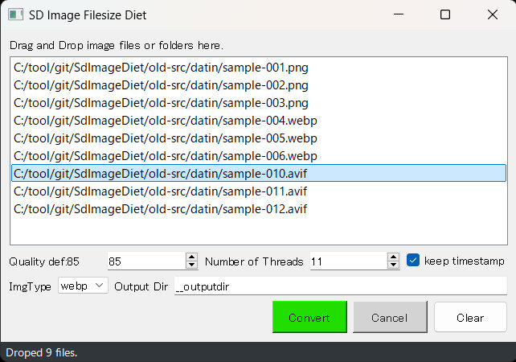

## SdImageDietについて 0.1.2
StableDiffusionで作成したPNG,JPG,WEBP画像のプロンプト情報を保持したまま「マルチスレッド」で高速にJPG,WEBP画像に変換します  
主にPrompt情報は後で参考にしたいが、画像品質を犠牲にしてファイルサイズを小さくしたい利用シーンを想定しています  
また、比較的どうでも良い画像ファイルの容量削減なんかにも便利です  

## 特徴
- 変換後のファイルでもPNG Infoタブで読み込んでtxt2txtなどに送る事が可能  
- マルチスレッドで高速に動作 ※1  
- 複数ファイル、フォルダのドラッグ＆ドロップに対応 ※2  
- 変換したファイルのタイムスタンプを元の画像ファイルに合わせる事も可能  
- Quality指定により画像品質を犠牲にすればファイルサイズを10分の1から50分の1に縮小可能  
- お好みでGUIでもCUIでも利用可能  

※1:Ryzen5 5600で1024x1344dotのPNG1000枚をJPGに変換するのに7秒程度、WEBPであれば1分強  
※2:GUI版のみ  

## インストール方法（簡易）
[簡易インストール版zipのダウンロード] https://github.com/nekotodance/SdImageDiet/releases/download/latest/SdImageDietGUI.zip

- zipファイルを解凍
- 解凍したフォルダ内の「SdImageDietGUI-install.ps1」を右クリックして「PowerShellで実行」を選択
- イントールの最後にデスクトップにリンクをコピーするかどうかを聞いてきます  
「"Do you want to copy the shortcut to your desktop? (y or enter/n)」  
必要があれば「y」入力後、もしくはそのまま「enter」キー  
必要なければ「n」入力後「enter」キー  
- SdImageDietGUIリンクが作成されます

リンクファイルをダブルクリックして起動できます

## インストール方法（手動）
インストールフォルダをC:\tool\git\SdImageDietとした場合で説明  
！Pythonはインストールされていて最低限の知識はあるものとします！  

#### 1)C:\tool\git\SdImageDietを作成
#### 2)以下のファイルを格納
  sdfileUtility.py  
  SdImageDiet.py  
  SdImageDietGUI.py  
  pvsubfunc.py  
  ng.wav  
  ok.wav  

#### 3)コマンドプロンプトを立ち上げて以下を実行する。この手順はインストールの一度のみ
###### 3-1)カレントフォルダの移動
    c:
    cd C:\tool\git\SdImageDiet
###### 3-2)venv環境を作成、activate
    py -m venv venv
    .\venv\Scripts\activate.bat
###### 3-3)利用するライブラリをインストール
    pip install PyQt5 Image piexif
###### 3-4)動作確認
    py SdImageDietGUI.py
    
#### 4)起動に便利なショートカットの作成
  適当なフォルダで右クリックして「新規作成」->「ショートカット」  
「項目の場所を...」に以下を入力
  C:\tool\git\SdImageDiet\Scripts\pythonw.exe C:\tool\git\SdImageDiet\SdImageDietGUI.py  
  
  今後は作成したショートカットをダブルクリックでアプリのように使えます  

## 利用方法（GUI版）

#### 1)アプリ上に複数の画像ファイルかフォルダをドラッグ＆ドロップしてください  
現時点でPNG、JPG、WEBPの画像ファイルの入力に対応しています  

注意１：フォルダをDropした場合は下層フォルダを再帰的にチェックします。あまりに上位のフォルダをDropしないように注意してください  
注意２：jpg指定「test.PNG、test.WEBP」の場合、どちらも出力ファイル名がtest.jpgとなりますのでファイル名重複でエラーとします  
注意３：Dropしたフォルダ、もしくはその配下に2-5)で説明するOutput Dirが含まれる場合、そのフォルダ以下は対象外とします  

#### 2)必要があれば設定値を変更  
###### 2-1) Quality
品質は1-100が指定でき、デフォルト値は85としています ※3  
お好みの値に調整してください  

※3:jpgの場合85、webpの場合40くらいが個人的に我慢できる限界の値  

###### 2-2) Number of Threads
スレッド数は1-「CPUの最大スレッド数」が指定でき、デフォルト値は「CPUの最大スレッド数 - 1」としています  
CPUの最大スレッド数を指定した方がほんの少しだけ早く終わりますが、OS動作がカクカクするかもしれません  

###### 2-3) keep timestamp
チェックした場合、出力画像ファイルのタイムスタンプを変換元の画像ファイルに合わせます  
shutil.copystat()を利用しているため最終更新日時以外のファイル情報もコピーされます  

###### 2-4) ImgType
jpg,webpのいずれかを選択してください  

###### 2-5) Output Dir
変換した画像の出力フォルダを指定してください  
注意：変なフォルダを指定しないでください、気にせずそのフォルダに書き込みます  

jpg指定で出力フォルダ__outputdirの場合、変換した画像は以下の用に格納されます  
c:/data/test.PNG -> c:/data/__outputdir/test.jpg

#### 3)Convertボタンを押す  
- 変換を開始し、処理完了まではCanselボタンにより中断できます  
- 処理中の状況をstatus部分に[変換済みファイル数/総数]で表示します  
処理が正常に完了すればok.wavを再生します  

#### status
ドラッグ＆ドロップ時のファイル数や変換処理状況、変換結果などを表示します  
エラーのBeep音ng.wavが再生された場合、ここの理由を参照してください  

## 利用方法（コマンドライン版）
以下の方法で利用できます  
usage: SdImageDiet.py [-h] [--imgtype IMGTYPE] [--quality QUALITY] [--threads THREADS] [--keeptimestamp] input output  
  
Convert Image file to JPG or WEBP with metadata.  
  
positional arguments:  
  input              : Input file or directory containing Image files. (png, jpg, webp)  
  output             : Output file or Output directory  
  
options:  
  -h, --help         : show this help message and exit  
  --imgtype IMGTYPE  : Image type. def:jpg, webp. If output is a file specification, the file extension takes precedence.  
  --quality QUALITY  : quality (1-100). Default is 85.  
  --threads THREADS  : Number of threads for parallel processing. Default is CPU Max Thread - 1.  
  --keeptimestamp    : keep the original timestamp of input files.  

## 注意事項
- 厳密なファイルチェックはしていないので気をつけてください（例えばとてつもなく大きいサイズなど）  
- Prompt情報はExifのUserCommentに保存しています  
- Automatic1111の出力したPNG、Forgeの出力したPNG、WEBPファイルでしか確認していません  
- アプリによってはExifコメントの文字コードを正確に判断できないかもしれませんが、ForgeのPNG Infoでの読み込みが正常に行われる事を優先しています  

## コマンドラインなどに詳しい人だけのトリッキーな使用方法
かなりリスクはありますが、ちょっとトリッキーな使用方法として以下のような指定も可能です  
- 「test」フォルダをドロップ、output Dirに「../test-converted」を指定。testフォルダと同じ階層のtest-convertedフォルダに変換結果を生成します  
- 「test」フォルダをドロップ、output Dirに「../test」、もしくは「./」を指定。自分自身と同じフォルダに上書き変換します（ファイル形式が同じだとタイムスタンプの維持は不可）  

output dirの追加をドロップしたパスではなく、個別の画像ファイルのパスに付与する仕組みのため、複数フォルダや複数階層のフォルダをドロップした場合には破綻します  
もしかすると複数フォルダのドロップを禁止して、入力パスに対してoutput dirを付与する方が使い勝手が良いのかもしれません。。（検討中）  

## 変更履歴
- 0.1.2 Converボタンの押し間違いをしやすいのでスペースを追加
- 0.1.1 拡張子が大文字だった場合の判定ミスを修正
- 0.1.0 初版

以上
